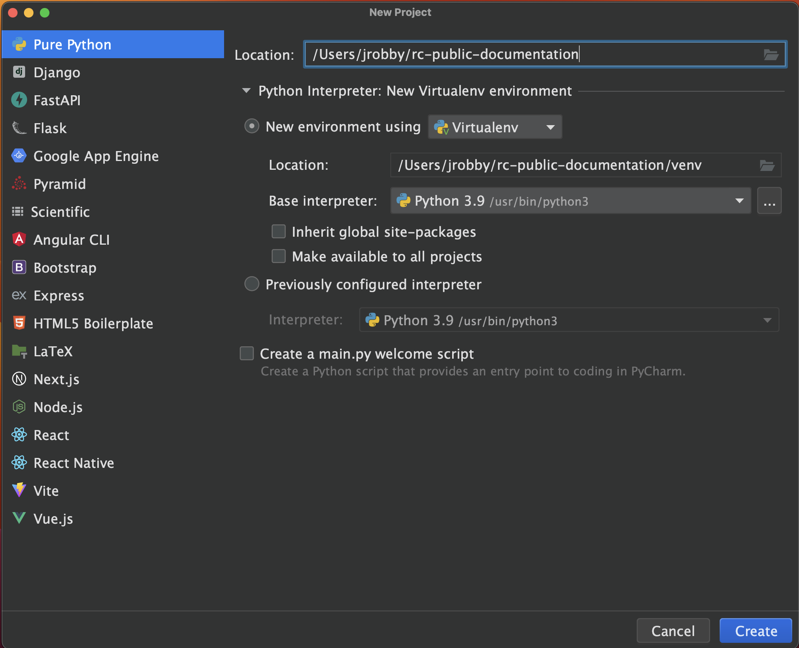
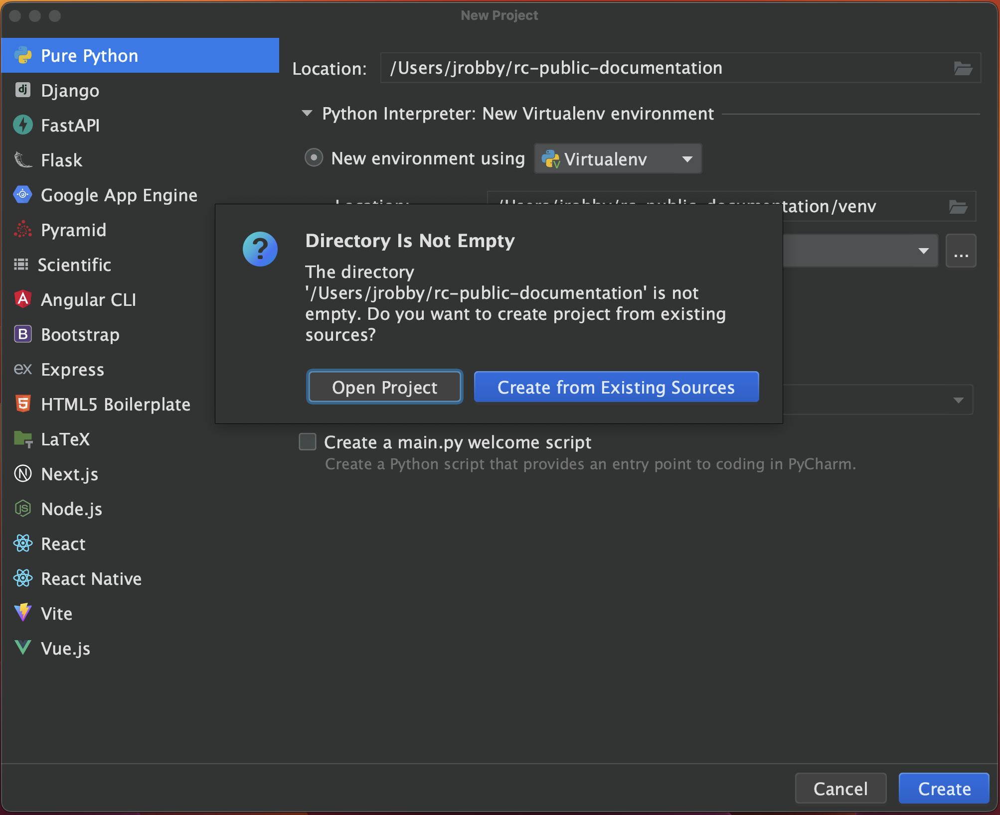
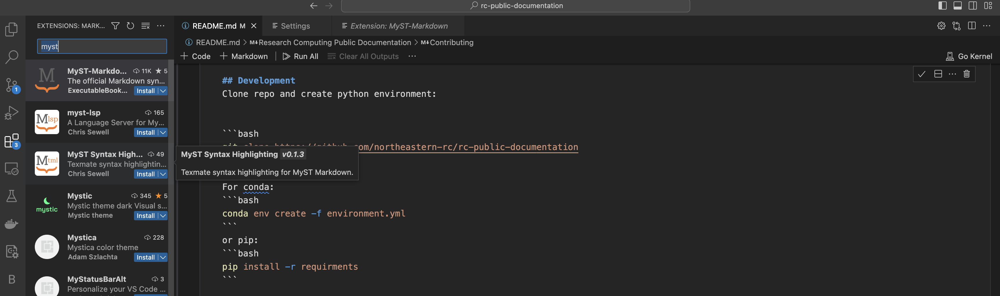
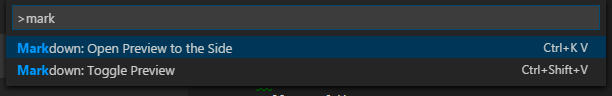

# Research Computing Public Documentation
[![GitHub-CI][github-ci]][github-link]
[![Documentation Status][rtd-badge]][rtd-link]


This repository contains the source files for the Research Computing documentation.

HPC users can submit issues and bugs in the documentation [here](https://github.com/northeastern-rc/rc-public-documentation/issues/new/choose).


## Development
Clone repo:

```bash
git clone git@github.com:northeastern-rc/rc-public-documentation.git
```
Then, either open PyCharm and create python environment (some find easier to create environment using PyCharm):


<br>


OR, do so via the command-line:
```bash
cd rc-public-documentation

python3.11 -m venv .venv
source venv/bin/activate
pip install --upgrade pip
```
-----

Next, for those using Mac, install pre-commit via `brew`:
```bash
brew install pre-commit
```
For those on windows, use `pip`:
```bash
pip install pre-commit
```
Then, install `pre-commit` for RTD development:
```bash
$ pre-commit install
pre-commit installed at .git/hooks/pre-commit

pip install -r docs/requirements.txt
```

---

[Install Dependencies][install-vscode]:

Launch VS-Code and open the project folder.

Install [myst-plugin-install][myst-plugin-install]; also, install directly from VS-Code by searching Extensions for `myst`.




You can use the [amazing markdown lint VS Code extension](https://thisdavej.com/build-an-amazing-markdown-editor-using-visual-studio-code-and-pandoc/#:~:text=markdownlint%20VS%20Code%20extension) developed by David Anson.  Here are the steps:

- Press `F1` to open the VS Code Command Palette.
- Type `ext install markdownlint` to find the extension
- Press Enter or click the cloud icon to install it
- Restart Visual Studio Code if prompted


Or for package development:

```bash
pip install myst-parser
npm install -g myst-cli
```

- Open Visual Studio Code
- Press `Ctrl+P`/`Ctrl+P`/`⌘P` to open the Quick Open dialog
- Type `ext install markdownlint` to find the extension
- Click the `Install` button, then the `Enable` button

You can also create a separate Window pane to preview your Markdown.  To do this:

- Press F1 to bring up the VS Code Command Palette.
- Type “mark” to narrow down the list of commands to “markdown” commands.
- Click “Markdown: Open Preview to the Side as shown here:
- Markdown Preview


## Spell Check
Be sure to source your Python environment, so it works for building Sphinx docs.
```Bash
git clone git@github.com:pyenchant/pyenchant.git
cd pyenchant
python setup.py install
```
Or, simply run from the `rc-public-documentation` folder:
```Bash
bash bin/install_spellchecker.sh
```


## Additional
- [Code Spell Checker](https://marketplace.visualstudio.com/items?itemName=streetsidesoftware.code-spell-checker)
- [Markdown helper](https://marketplace.visualstudio.com/items?itemName=joshbax.mdhelper)
- [emojisense](https://marketplace.visualstudio.com/items?itemName=bierner.emojisense)
- [markdown-all-in-one](https://marketplace.visualstudio.com/items?itemName=yzhang.markdown-all-in-one)

https://sphinx-design.readthedocs.io/en/latest/dropdowns.html
## Contributing

We welcome all contributions!
See the [Contributing Guide](https://myst-parser.readthedocs.io/en/latest/develop/index.html) for more details.

[github-ci]: https://github.com/executablebooks/MyST-Parser/workflows/continuous-integration/badge.svg?branch=master
[github-link]: https://github.com/executablebooks/MyST-Parser
[rtd-badge]: https://readthedocs.org/projects/myst-parser/badge/?version=latest
[rtd-link]: https://myst-parser.readthedocs.io/en/latest/?badge=latest
[install-vscode]: https://code.visualstudio.com/
[myst-plugin-install]: https://marketplace.visualstudio.com/items?itemName=ExecutableBookProject.myst-highlight
