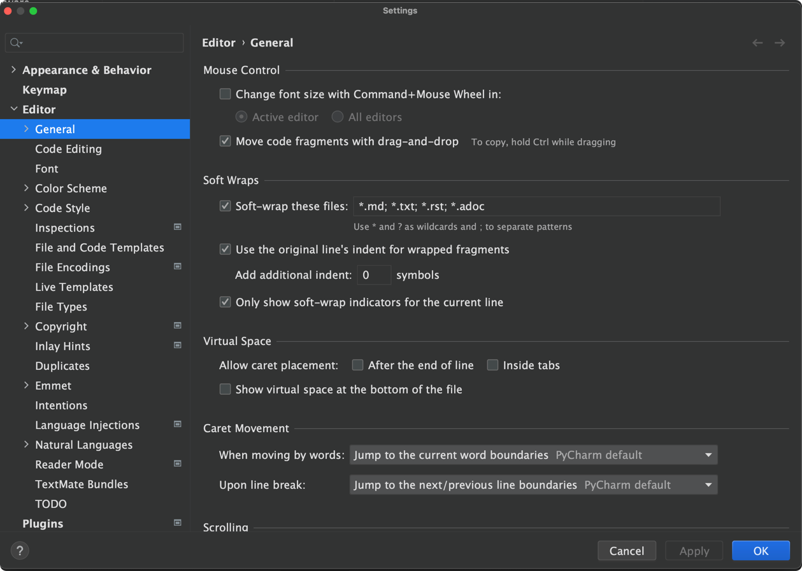

# Documentation Primer

:::{important}
Remember that this style guide is a reference for team members working on documentation. It is essential to keep it up-to-date and easily accessible for all contributors.
:::

This style guide outlines the best practices and conventions for creating clear, consistent, high-quality documentation for our project. By following these guidelines, we can ensure a cohesive writing style and tone across all documentation.

The purpose of the guide is to provide guidelines for writing clear, concise, and consistent documentation. It covers language, tone, formatting, and other aspects of documentation.

::::{seealso}
Our RTD is sphinx-based using a superset of Markdown called MyST.

The following are RTD-worthy bookmarks:
- [MyST Syntax]
- [MyST Spec]
- [MyST-Parser Documentation]
- [MyST-Typography]
- [Markdown cheatsheet]
- [MyST How-To Guide]
- [MyST Example Pages]

:::{important}
As specified below, using colons (i.e., `:::`) in place of the typical hyphens when opening and closing blocks.
:::

::::

##  Writing Style
:::{admonition} Dates and Time
Use EST and specify this when date or time are used (e.g., `September 9, 2023 at 9-5 a.m. ET`).
:::
The writing style in documentation is critical for ensuring consistency and understanding. Here are some best practices:

**Clarity**: Be as clear and straightforward as possible. Avoid ambiguity, along with complex sentences and unusual words. **KEEP IT SIMPLE.**

:::{list-table}
---
header-rows: 1
widths: 50 50
align: left
---
* - ❌ Do Not
  - ✅ Do
* - The initiation of the replication process...
  - To start the replication process...
:::

**Conciseness**: Keep sentences and paragraphs short. This makes text easier to read and understand.

:::{list-table}
---
header-rows: 1
widths: 50 50
align: left
---
* - ❌ Do Not
  - ✅ Do
* - Once the process has been completed successfully, the next step is...
  - Next, ...
:::

**Active Voice**: Use the active voice whenever possible as it is more straightforward and engaging.

:::{list-table}
---
header-rows: 1
widths: 50 50
align: left
---
* - ❌ Do Not
  - ✅ Do
* - The command can be executed by the user.
  - Execute the command.
:::

**Address the Reader**: Use the second person ("you") to address the reader directly.

:::{list-table}
---
header-rows: 1
widths: 50 50
align: left
---
* - ❌ Do Not
  - ✅ Do
* - One can see the results by... <br>
  - You can see the results by...<br>
:::

- If you need to explain complex concepts, break them into smaller, more manageable sections to help your reader understand your message.

##  Formatting
MyST allows for markdown to be used for our Sphinx project (i.e., [RTD]).

:::{admonition} Bookmark and Review-worth Reference
Check out this [Markdown cheatsheet].
:::

Commonly used elements follow the [MyST-Typography].

Directives allow us to insert and format various elements (e.g., images, callouts, etc.). We use `colon_fence` (i.e., [Colon Fence Directives]) to replace the typical hyphens.

:::::{important}
We use the [`colon_fence` extension] rendered by MyST parses three colons (i.e., *:*) to open and close blocks.

Optional args specified for a directive are listed in [MyST Spec].

::::{note}
[MyST-Parser Documentation] includes several constructs we can use to enhance our pages. **Use elements with purpose, whether to call attention, reference related content, or warn.
::::

Nesting blocks, along with the ability set parameters inline.

::::{note}
There is no need to indent source text, as nested directives are explicitly clear by the number of `:` characters are used to open and close.
::::

::::{important}

**Do not add line-breaks unless a line break in the rendered view is to need a line break.** Each paragraph remains on the same line, with line-breaks using to clearly show transitions between paragraphs, sections, and directives.

:::{tip}
Set *Soft-Wrap* to be set to 100 characters by default when viewing `*.md`

<figure>
  
  <figcaption>Fig. Soft-Wrap set to 100 characters in PyCharm's <i>General</i> settings.</figcaption>
</figure>
:::

:::{note}
Add line-breaks before and after the opening and closing of directives (i.e., outside the struct). Only add a single line-break after opening, which is the case for most directives; for those that do not require any inputs but titles (e.g., `:::{directive} Title`), omit line-breaks after the opening.
:::
::::

::::{important}
These nested admonitions were done, mostly, to demonstrate how it can be done. There are exceptions, but this is quite nested: be sure to consider if the flow of information is done most effectively when nests deeper, or even as deep as this example (i.e., five colons `:::::` deep).
::::
:::::

Consistent formatting makes your documentation look professional and easy to read. Use consistent formatting for headings, lists, tables, and other elements, and adequately nest subheadings and lists. Here are some guidelines:

- **Headings**: Use headings and subheadings to structure your content. In MyST, use # for level 1 headings, ## for level 2, and so on.
- **Lists:** Use bulleted lists for unordered items and numbered lists for ordered items. In MyST, use bullets `-` for unordered lists and numbers `1.` for ordered lists.
- **Bold and Italics**: Use bold to highlight important concepts and italics to indicate new terms. In MyST, use bold text** for bold and italic text* for italics.
- **Code Blocks**: Use code blocks to present code snippets. In MyST, use triple colons `:::` to create code blocks and specify the language for syntax highlighting.
- **Admonitions**: Use MyST syntax to create admonitions highlighting notes, tips, warnings, and other important information. For example, use `:::{note}` or `:::{warning}` to create admonitions.

:::{seealso}
List [admonitions] types (i.e., callouts) available.
:::

### Admonitions
Admonitions highlight a particular block of text that exists slightly apart from the narrative of your page, like so:

:::{admonition} This is the title
This is the message.
:::
There are several types of admonitions. We only use four types, which are listed as follows:

:::::{grid} 2

::::{grid-item-card}
:::{important}
- Use to put emphasis on a sub-topic or sub-point.
- Use to put emphasis on a specific point.
- Use when extra care is warranted for a specific task.
- Use to warn user of expected behaviors or outputs.
:::
::::

::::{grid-item-card}
:::{note}
Use to add a side-note or footnote.
:::
::::
::::{grid-item-card}
:::{seealso}
Use to reference another section, page, or reference that extends, provides details on subtopic or step, or serves as supplemental.
:::
::::

::::{grid-item-card}
:::{tip}
- Use to provide pro-tips or tips & tricks.
- Use to make a suggestion.
:::
::::
:::::

### Tabs
[MyST Tabs] are a great way to present material (see {ref} GPUs for Deep Learning). It is essential for these to be used properly: situations where the same task or topic spans multiple setups or interfaces. For instance, installing deep learning to run on the GPUs is the task in the aforementioned example, where the tab chose is either PyTorch or Tensorflow.

##  Code Example
Code examples can help readers understand how to use a feature or solve a problem. Here are some guidelines to follow:
- **Clarity**: Ensure that your code is easy to understand. Include comments to explain complex or essential parts of the code.
- **Syntax** Highlighting: Use syntax highlighting to make your code easier to read. In MyST, you can specify the language for syntax highlighting in code blocks (see [MyST Source code and APIs]).
- **Error Handling**: If relevant, show how to handle errors and exceptions.
- **Consistency**: Ensure your code examples follow the same coding style, including indentation and naming conventions.
- **GitHub**: Reference the repo if snippets from another RC GitHub project is referred.

::::{note}
Commented code, along with well-written self-documenting code, is a good way to avoid being too verbose. In other words, consider the purpose of the steps being presented, and if the purpose is using OpenMPI, as an example, there is no need to have a single code block for every step (e.g., put the loading of modules, creating of conda, changing directories, etc., in the same block). If you believe it is useful to add comments or provide a `{seealso}` to point to a page on Conda or modules, go ahead, but let's not repeat information and saturate our readers: **BE COMPLETE, YET CONCISE, WITH CODE.**

:::{tip}
Long snippets of code tend to be easier to read when presented on several lines, with new-lines added strategically. For instance, if command-line, use `\` to separate key-value when there are many arguments passed.
:::
::::

##  Language and Terminology
Clear and consistent language and terminology are crucial for effective communication. Here are some guidelines:
- **Consistency**: Use terminology consistently. Don't use different terms for the same concept.
- **Acronyms**: Always define acronyms the first time you use them.
- **Jargon**: Avoid using jargon unless necessary. If you have to use it, define it first.
- **Language**: Use either American or British English consistently throughout your documentation.

## Documentation Structure
- Organize documentation into folders that represent sections, with each file as an item of its section.
- Use a clear hierarchy for headings and subheadings.
  - A single level-one heading (i.e., `# HEADING`) at the top of the page: `HEADING` will appear in the table of contents.
   - Add file path to [index.md] as follows:
:::{code-block}
```{toctree}
:hidden:
:caption: section

directory/filename
```
:::
Where *section* is the top-level index listed in the table of contents and *filename* is the markdown file. Note that `.md` can be omitted. Furthermore, when naming a file or directory, use all lowercase with no spaces. For example, {ref}`home-directory-storage-quota` is simply named `homequota.md`.

- Ensure each page has a clear purpose and covers a single topic.

(links-references)=
##  Links and References
Links and references are crucial for helping users navigate your content and providing additional context. Here's how you can effectively use them in your documentation:
- Use descriptive link text instead of generic phrases like "click here" or "learn more."
- Regularly check for broken links.
- Reference external sources when necessary and provide proper attribution.
- Use cross-references to link to other sections within the documentation. [Text can also be modified inline.](links-references) (i.e., `[Text can also be modified inline.](linksreferences)`).
- Descriptive Links: Avoid using phrases like "click here" for hyperlink text. Instead, use descriptive text that informs the reader about the content they'll find when they follow the link.

:::{important}
Section labels should be all lowercase, with `-` placed between the words (e.g., `(section-one)`.
::

:::{list-table}
---
header-rows: 1
widths: 50 50
align: left
---
* - ❌ Do Not
  - ✅ Do
* - Click here for more information about the installation process.
  - Read our comprehensive installation guide.
:::

- Attribution: If you're citing external sources or using someone else's work (e.g., images, code snippets), attribute the source correctly.

##  Images and Diagrams
Visual content like images and diagrams can significantly enhance your documentation. Here are some guidelines:
- **High-Quality Images**: Always use high-resolution images that are clear and easy to see. If you're using screenshots, ensure they accurately represent the current version of your product or interface.
- **Descriptive Alt Text**: Always provide alt text for your images. The alt text describes the image for people who can't see it, whether due to visual impairments, technical issues, or because they're using a screen reader.
- **Simple Diagrams**: Keep your diagrams simple. Avoid including unnecessary details that could confuse your readers.
- **Consistent Style**: If you use multiple diagrams, ensure they have a consistent style and use the same symbols and conventions.

## Markdown and MyST Syntax

Markdown and MyST provide a simple way to format your content. Here are some tips for using these syntax effectively:
- **Basic Markdown**: Familiarize yourself with basic Markdown syntax, including headers, lists, links, images, and code blocks.
- **MyST Features**: MyST extends the standard Markdown syntax with additional features such as cross-references, footnotes, directives, warnings, and other particular elements. Make sure you understand how to use these features correctly.
- **Code Blocks**: Use triple backticks to create code blocks and specify the language for syntax highlighting.
- **Admonitions**: Use MyST's admonition syntax to highlight important information. For example, `:::{note}` creates a note, and `:::{warning}` creates a warning.

:::{note}
There are many [admonitions] to choose from. Use your best judgement, look at other examples, and be sure to use the appropriate tone.
:::

- **Consistency**: Be consistent with your use of MyST syntax. For example, always use the same header level for section titles, the same style for lists, etc.
- Follow the MyST syntax for advanced features such as directives and roles.

##  Review Process
Finally, ensure your documentation undergoes a thorough review process before it's published. We do this through PRs on GitHub.

- **Peer Review**: Encourage team members to review each other's work. This can help catch errors, ambiguities, and inconsistencies the original writer may have missed.
- **Proofreading**: Check for spelling, grammar, and punctuation errors. Tools like Grammarly or language-tool can help with this.

:::{tip}
When adding a substantial amount of content, whether a new page or several sections, consider using Notion to draft. Then, update the RTD pages (i.e., this project) for a technical review. This way, development can be more interactive, time is not wasted adjusting formatting and other syntax, and the history is much simpler (and more promising) than that of our own managed via Git.
:::

- **Technical Accuracy**: Ensure all code snippets, commands, and technical information are accurate and up-to-date.
- **Feedback**: Encourage users to provide feedback on your documentation. This can help you identify areas that need improvement.
- **Continuous Updates**: Keep your documentation up-to-date. As your product evolves, so should your documentation.

:::{important}
All members of the RC are welcome to contribute on the documentation. In fact, it is encouraged and much appreciated. Do not hesitate to ask for tasks or make suggestions to improve our *User Facing Documentation*.
:::

Remember, good documentation is an ongoing effort. Always strive to improve and adapt to your users' needs.

[MyST Syntax]: https://myst-parser.readthedocs.io/en/v0.15.1/syntax/syntax.html#
[MyST-Parser Documentation]: https://myst-parser.readthedocs.io/en/v0.13.5/using/howto.html
[MyST-Typography]: https://myst-parser.readthedocs.io/en/latest/syntax/typography.html
[`colon_fence` extension]: https://myst-parser.readthedocs.io/en/latest/syntax/optional.html\#code-fences-using-colons
[Markdown cheatsheet]: https://www.markdownguide.org/basic-syntax/
[admonitions]: https://jupyterbook.org/en/stable/reference/cheatsheet.html\#admonitions
[Colon Fence Directives]: https://mystmd.org/guide/syntax-overview#example-fence
[RTD]: https://readthedocs.com/
[index.md]: https://github.com/northeastern-rc/rc-public-documentation/blob/master/docs/source/index.md
[MyST Source code and APIs]: https://myst-parser.readthedocs.io/en/latest/syntax/code_and_apis.html
[MyST How-To Guide]: https://myst-parser.readthedocs.io/en/v0.13.7/using/howto.html
[MyST Example Pages]: https://myst-parser.readthedocs.io/en/v0.13.7/examples/index.html
[MyST Tabs]: https://mystmd.org/guide/dropdowns-cards-and-tabs#tabs
[MyST Spec]: https://mystmd.org/spec
[MyST Cross Reference]: https://myst-parser.readthedocs.io/en/v0.15.1/syntax/syntax.html#targets-and-cross-referencing
