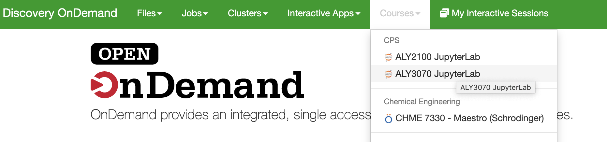
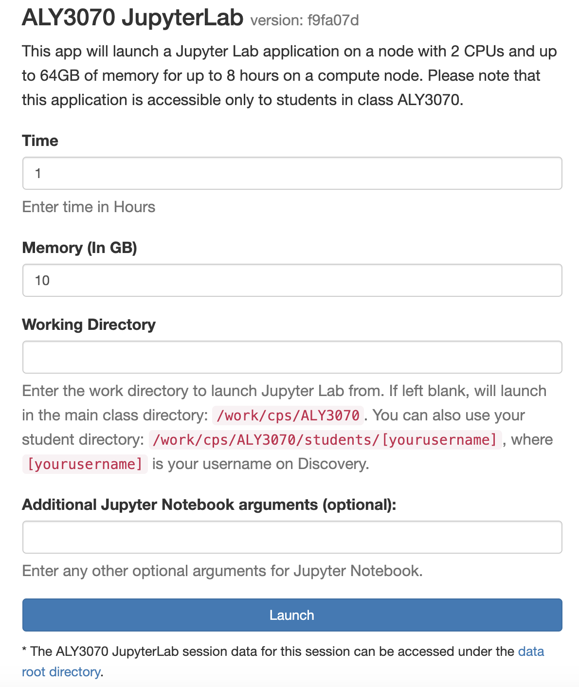
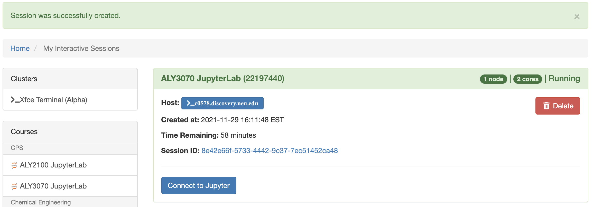
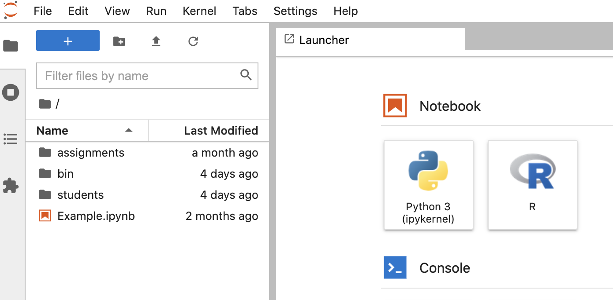
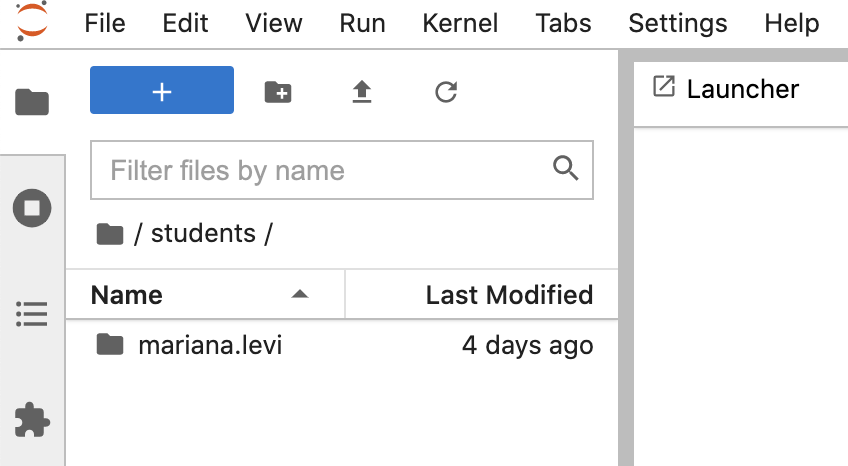
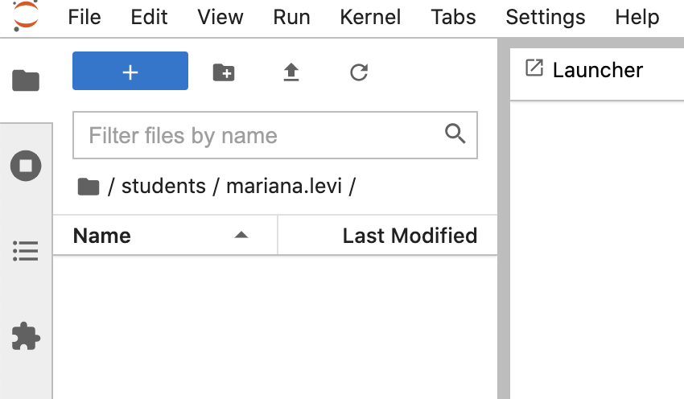
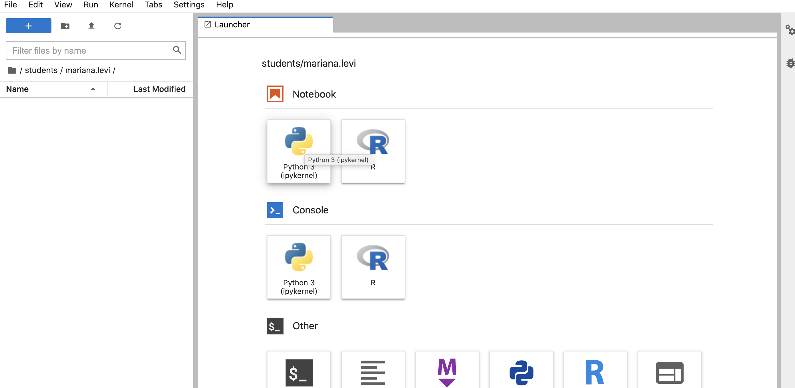
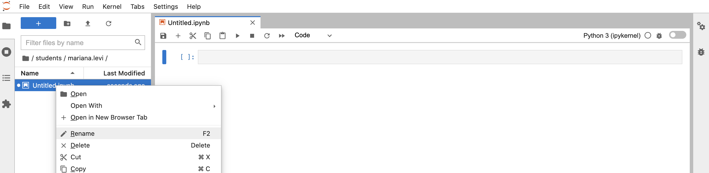
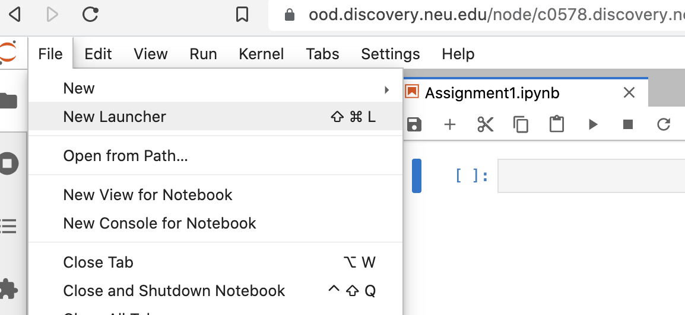
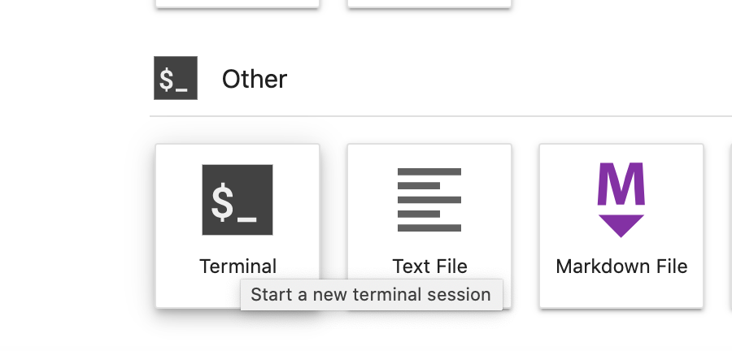

(cps-ood)=

# CPS Class Instructions

:::{caution}
**Note - The following instructions will only work for CPS classes.**
:::

These instructions describe the process of opening a CPS JupyterLab environment on the Open OnDemand (OOD) Discovery web portal and accessing class work directories.

:::{note}
Due to problems with launching OOD on **Safari**, we recommend using **Google Chrome**, **Mozilla Firefox** or **Microsoft Edge** browsers instead for best experience.
:::

## Open the CPS JupyterLab environment

:::{important}
The class instructor needs to fill in the: [Discovery Classroom Use Request] You will only be able to find your class resources if a request was already made.
:::

1. In a web browser, go to <http://ood.discovery.neu.edu>. Login with your NU credentials.

2. Under the **Courses** menu, select your Class Name (For example: **ALY3070 JupyterLab**).

<!--  -->

3. Select the default options and click **Launch**. Wait until the session is successfully created and ready to be launched (turns green).

<!--  -->

4. For more control of the session, modify **Time** for the session time (in hours), **Memory** to get more memory in GB, and the **Working Directory** where JupyterLab will launch.

:::{note}
If **Working Directory** is left blank, the session will launch in the main class folder (in this example `/work/cps/ALY3070`). Alternatively, start the session directly from your personal working directory by entering: `/work/cps/ALY3070/students/[username]`, where `[username]` is your username on Discovery. The instructions below assume the field is left blank.
:::

5. Click **Connect to Jupyter** to open JupyterLab. This will open a JupyterLab interface in another tab.

<!--  -->
:::{caution}
Select **Cancel** when prompted with the **Build Recommended** option. The package jupyterlab-dash does not require a build, and will not work when build is enabled.
:::
<!--  -->

## Access CPS class directories

1. After you are connected to a CPS JupyterLab session on OOD, you can access any shared class directories and your private class directory.

<!-- 2. You can navigate between the class folders using the left menu. Your instructor may share files in this directory.  -->
2. You can navigate between the class folders using the left menu. The files in the shared class directory are read ony and the students do not have persmissions to edit or remove the files. Your instructory may use the shared class directory to share files related to the classwork

<!-- :::{note}
The files in the shared class directory are read only and the students do not have permissions to edit or remove the files.
::: -->

<!--  -->

<!-- For instance, file **Example.ipynb** can be viewed using Python Jupyter notebook (but not edited or removed). -->

3. Naviate to your personal class directory under: `/students/<your username>`. Now you can create and edit Jupyter notebook files here.

<!--  -->

<!--  -->

4. Open a new Python notebook session from the Launcher menu by clicking the **Python 3 (ipykernel)**.

<!--  -->

5. A new file will be created inside your directory called **Untitled.ipynb**. You can rename it by right-clicking on it and using the rename option.

<!--  -->

6. This Python notebook has ready-to-use Python packages needed for your class.

:::{note}
**Permission Denied errors:**
Do not attempt to create, edit or write files that are outside of your personal student directory. Most "Permission Denied" errors are due to directories or files having read-only access permissions.
:::

## Submit CPS class assignments

:::{important}
Due to the write-only access permissions on the **assignments** directory, it is required to use the command line interface (Linux Terminal) to submit assignments. **Using other methods, such as the JupyterLab interface or OOD file explorer, currently does not work**.
:::

1. To submit your assignment (for example, named: **Assignment1.ipynb**) to the **assignments** directory, open the JuypterLab new launcher by clicking the **File** top menu option, and then selecting **New Launcher**.

<!--  -->

2. Click on the **Terminal** option under **Other** to open a Linux terminal.

<!--  -->

3. Navigate to your personal directory by typing the following command (change the class name from `ALY3070` to your class name accordingly).

:::
cd /work/cps/ALY3070/students/$USER
:::

4. Where `$USER` is a saved shell variable for your username. You can optionally also replace it with your username.

5. Check that your assignment file is visible in the command line by typing `ls`. Then, copy the assignment file to the **assignments** directory with this command (replace **Assignment1.ipynb** with your file name).

:::
cp Assignment1.ipynb ../../assignments
:::

6. To remove an existing assignment, type (replace **Assignment1.ipynb** with your file name).

:::
rm ../../assignments/Assignment1.ipynb
:::

7. Close the terminal tab when done.

[discovery classroom use request]: https://bit.ly/NURC-Classroom
